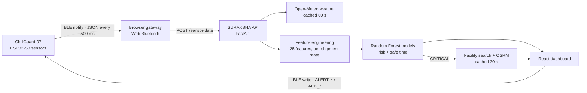
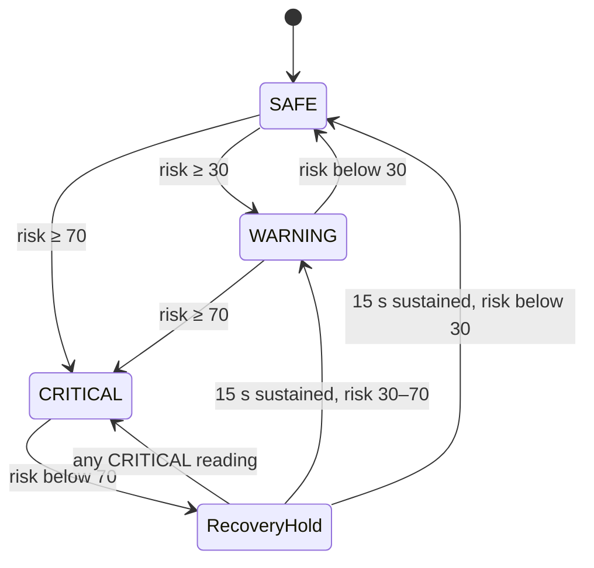

# MedRakshak

**AI-Powered Real-Time Pharmaceutical Cold Chain Monitoring and Intelligent Logistics System**

Smart India Hackathon 2026 · Project dossier

| Field | Value |
|---|---|
| PS number | SIH26215 |
| Organisation | AICTE · Student Innovation |
| Category | Hardware |
| Theme | MedTech / BioTech / HealthTech |
| Edge unit | ChillGuard-07 (ESP32-S3) |
| Backend | SURAKSHA API (FastAPI + scikit-learn) |
| Monitored bands | Vaccine / refrigerated medicine 2–8 °C · Room-temperature medicine 15–25 °C |

---

## Contents

1. [Summary](#1-summary)
2. [The problem](#2-the-problem)
3. [Problem statement fit](#3-problem-statement-fit)
4. [Solution overview](#4-solution-overview)
5. [Architecture & data flow](#5-architecture--data-flow)
6. [Edge hardware: ChillGuard-07](#6-edge-hardware-chillguard-07)
7. [BLE gateway](#7-ble-gateway)
8. [Backend API (SURAKSHA)](#8-backend-api-suraksha)
9. [Feature engineering](#9-feature-engineering)
10. [Machine learning models](#10-machine-learning-models)
11. [Alert logic](#11-alert-logic)
12. [Emergency rerouting](#12-emergency-rerouting)
13. [Dashboard](#13-dashboard)
14. [Technology stack](#14-technology-stack)
15. [Related work & novelty](#15-related-work--novelty)
16. [Impact & benefits](#16-impact--benefits)
17. [Limitations](#17-limitations)
18. [Future scope](#18-future-scope)
19. [Running the demo](#19-running-the-demo)
20. [References](#20-references)

---

## 1. Summary

Vaccines, insulin and biologics lose potency when they leave their storage band, and the damage is often invisible: a spoiled vial looks the same as a good one. India already digitises temperature at fixed storage points, but the truck or cold box between two stores remains the weakest link in the chain.

**MedRakshak** closes that gap. A sensor box (ChillGuard-07) rides inside the shipment and streams temperature, humidity, shock, lid status and GPS twice a second over Bluetooth Low Energy. A FastAPI backend turns every reading into 25 engineered features, adds live weather at the truck's position, and runs two Random Forest models that predict a **spoilage risk score (0–100)** and the **remaining safe time** before the product is compromised. The result is classified **SAFE**, **WARNING** or **CRITICAL**, shown on a live dashboard, and pushed back to the box itself as a green, blue or red LED with an alarm.

When risk turns CRITICAL, the system searches a facility dataset for the nearest active cold store that can hold the product's temperature range, road-routes to the top candidates, and recommends the fastest diversion.

**At a glance**

| Figure | Meaning |
|---|---|
| 500 ms | Telemetry interval from the box |
| 25 | Engineered features per reading |
| 2 × 2 | Random Forest models (real + demo pairs) |
| 3 | Alert tiers, mirrored on the box LEDs |
| 28,000 | Facility records searched for rerouting |

---

## 2. The problem

Most vaccines and many medicines must be kept between **+2 °C and +8 °C**. Heat exposure degrades them cumulatively, and freezing irreversibly damages freeze-sensitive vaccines such as those containing aluminium adjuvants [4][3]. WHO has estimated that as much as half of the vaccine supplied globally is wasted, from all causes including cold-chain failures [1].

### Evidence from India

A study that shipped temperature recorders with real vaccine vials through the routine supply chain of 10 Indian states found [2]:

- Boxes were above 8 °C for **14.3%, 13.2%, 8.3% and 14.7%** of storage time at state, regional and district stores and peripheral facilities.
- In **transit**, boxes spent about **18%** of the time below 0 °C and **7%** above 8 °C.
- At the end of the study, **two-thirds** of the vials showed evidence of freezing in shake tests.

India's electronic Vaccine Intelligence Network (eVIN) digitised vaccine stock and temperature monitoring at cold chain points. Across 12 states it cut vaccine utilisation from 305.3 to 215.0 million doses (about 90 million doses saved) and reduced facilities with stock-outs by 30.4% [7]. Counting newer vaccines, each rupee invested returned ₹1.41, projected to rise to ₹2.93 once only recurrent costs remain, and eVIN has since expanded to all 731 districts across 36 states and UTs [8].

### The gap MedRakshak targets

| Gap | Detail |
|---|---|
| Monitoring stops at the store door | Digital monitoring is concentrated at fixed storage points, while the 2013 study found the worst sub-zero exposure during transport and at peripheral facilities [2]. |
| Alerts are thresholds, after the fact | A threshold alarm says the band was crossed. It does not say how much damage has accumulated or how much safe time is left. |
| No automatic response | When a shipment is failing on the road, nobody is told where the nearest compatible cold store is or how long it takes to reach it. |
| Handling risks go unrecorded | Lid opening, tampering and rough handling are rarely logged alongside temperature. |

WHO's model guidance for time- and temperature-sensitive pharmaceutical products (TRS 961, Annex 9) sets out requirements for monitoring products during storage and transport, and is the regulatory frame this project works within [6].

---

## 3. Problem statement fit

| Field | SIH26215 |
|---|---|
| Title | Student Innovation — "Cutting-edge technology in these sectors continues to be in demand. Recent shifts in healthcare trends, growing populations also present an array of opportunities for innovation." |
| Organisation | AICTE |
| Category | Hardware |
| Theme | MedTech / BioTech / HealthTech |
| Idea deadline | 30 September 2026 |

- **Category matches.** MedRakshak is a physical sensor unit plus software, not a pure software product.
- **Theme matches.** Protecting the potency of medicines in transit is a healthcare problem.
- **No domain stretch.** The closest ministry problem statements (SIH26005 solar cold storage for vegetables, SIH26232 farm-to-fork IoT traceability) would force the pitch away from pharmaceuticals.

---

## 4. Solution overview

| Layer | Role |
|---|---|
| **Edge: ChillGuard-07** | ESP32-S3 box inside the shipment. Senses temperature, humidity, shock, lid state, cargo clearance, battery and GPS. Drives three alert LEDs, a buzzer, a servo lid lock and an IR cooling trigger. |
| **Link: Web Bluetooth gateway** | The browser pairs with the box over BLE, converts each JSON packet to the backend schema, stamps it with time and sends it to the API. It writes alert commands back to the box. |
| **Intelligence: SURAKSHA API** | FastAPI service. Per-shipment feature engineering, cached live weather, two Random Forest models, risk tiers, and emergency facility search with road routing. |
| **Command: React dashboard** | Live stat cards, GPS trail on an OpenStreetMap map, PCM cooling-flap status, weather, alert popups, an emergency modal with rerouting, and an event log. |

The loop is closed in both directions: the box feeds the model, and the model's decision comes back to the box as a physical light and sound that a driver sees without opening any app.

---

## 5. Architecture & data flow



### One reading, end to end

1. The box reads its sensors and notifies a ~300-byte JSON packet over BLE (MTU raised to 517 so the packet is not truncated).
2. The browser parses it, maps firmware fields to the API schema, adds `product_type`, a timestamp and the previous reading's `cooling_status`, and POSTs it.
3. The API looks up the product's temperature and humidity band and fetches weather for the GPS point (from cache when fresh).
4. `calculate_features()` updates the shipment's running state (time out of range, cumulative exposure, excursion count, shock count) and returns the 25-feature vector.
5. The selected model pair predicts spoilage risk and remaining safe time; risk is mapped to a tier.
6. If CRITICAL, the API finds and road-routes compatible cold stores and attaches a recommendation.
7. The dashboard updates, raises alerts once per excursion, and sends `ALERT_SAFE`, `ALERT_WARNING` or `ALERT_CRITICAL` to the box only when the tier changes.

---

## 6. Edge hardware: ChillGuard-07

Target board ESP32-S3 Dev Module, Arduino-ESP32 core 3.0 or later. Libraries: Adafruit DHT sensor library, TinyGPSPlus; BLE and LEDC PWM come with the core.

| Component | Role | GPIO |
|---|---|---|
| DHT22 | Chamber temperature and humidity | 4 |
| HW-201 IR sensor | Lid open / anti-tamper | 5 |
| 38 kHz IR transmitter | Sends cooling commands to the reefer unit (NEC-style burst) | 6 |
| Active buzzer | Door chirp and latching CRITICAL alarm | 7 |
| HC-SR04 ultrasonic | Cargo clearance distance | 10 / 11 |
| 801S vibration switch | Shock / crash (hardware interrupt) | 13 |
| NEO-6M GPS (UART1) | Position, speed, UTC time | 17 / 18 |
| SG90 servo | Smart lid lock, 0° locked / 180° unlocked | 21 |
| Red / Green / Blue LEDs | CRITICAL / SAFE / WARNING | 38 / 39 / 40 |
| Battery ADC | Voltage via 10 kΩ + 10 kΩ divider | 1 |

### Firmware behaviour

- **BLE GATT server** advertising as `ChillGuard-07`. Service `4fafc201-1fb5-459e-8fcc-c5c9c331914b`, telemetry characteristic (notify/read) `beb5483e-36e1-4688-b7f5-ea07361b26a8`, command characteristic (write) `1c95d5e3-d8f7-413a-bf3d-7a2e5d7be87e`.
- **Telemetry every 500 ms.** The DHT22 can only produce a fresh sample about every 2 s, so between samples the last valid reading is repeated.
- **On-device safety net.** If temperature exceeds 8 °C or rises faster than 0.5 °C/min, the box fires an IR cooling burst on its own (at most once every 15 s), even with no phone connected.
- **Shock detection** counts interrupt edges in a fixed 1 s window (≥ 2 pulses = shock) and latches the flag for 3 s so a brief knock still reaches the next packet.
- **Battery reading** averages 16 ADC samples and applies exponential smoothing to reject noise and actuator-induced sag.
- **Servo lock** uses continuous 50 Hz LEDC hardware PWM so the latch holds torque.
- **GPS time** is converted to a Unix epoch with the days-from-civil algorithm; uptime is used until a fix exists.
- **Non-blocking alarms**: door chirp toggles every 500 ms after 5 s open; CRITICAL alarm toggles every 300 ms.

### Telemetry packet

```json
{"id":"CG-TRUCK-07","ts":1758700000,"pkt":42,"temp":5.1,"hum":58.2,"t_rate":0.12,"h_rate":-0.30,
 "lat":12.9716,"lng":77.5946,"spd":0.0,"dist":31.4,"crash":false,"door":false,"door_s":0,
 "lock":0,"v_bat":3.84,"bat_pct":64,"led_mode":"auto","alert":"normal","ir":false,
 "up":120,"buf":0,"ble":true}
```

### Command set (app → box)

| Command | Effect |
|---|---|
| `ALERT_SAFE` · `ALERT_WARNING` · `ALERT_CRITICAL` | Sets the ML-driven tier: green, blue or red LED. A fresh CRITICAL re-arms the alarm. |
| `ACK_CRITICAL` | Silences the latching CRITICAL alarm for this episode. The red LED keeps tracking the live tier. |
| `ACK_WARNING` | Shows green instead of blue for the rest of this WARNING episode. Never masks CRITICAL. |
| `LOCK_BOX` · `UNLOCK_BOX` | Servo lid lock to 0° or 180°. |
| `IR_COOL_UP` · `IR_COOL_DOWN` | Manual IR cooling commands. |
| `RED/GREEN/BLUE_ON\|OFF` · `LED_AUTO` | Manual LED override and return to automatic. |
| `PING` · `BUZZER_ON\|OFF` | Pairing check (two beeps) and manual buzzer. |

---

## 7. BLE gateway

- Runs in the dashboard itself using the Web Bluetooth API (Chrome or Edge, served from `127.0.0.1` or HTTPS) [21]. BLE was chosen for its low power draw on battery-powered sensors [15].
- Reassembles packets that arrive split across notifications and discards garbage after 4,000 characters.
- Maps fields: `temp → temperature`, `hum → humidity`, `lat/lng → latitude/longitude`. The 801S is a digital switch with no magnitude, so `crash: true` maps to a representative 1.6 g shock, otherwise 0.
- Stamps each reading with the browser's clock. A **time-acceleration** control (1×, 5×, 10×, 20×) advances this clock faster for live demonstrations without jumps.
- Feeds the previous prediction's `cooling_required` back as `cooling_status`, and carries the chosen `model_mode` (real or demo).

---

## 8. Backend API (SURAKSHA)

| Endpoint | Purpose |
|---|---|
| `GET /health` | Service check |
| `POST /sensor-data` | Main pipeline: profile lookup, weather, features, prediction, rerouting on CRITICAL |
| `POST /reset-shipment/{id}` | Clears a shipment's accumulated ML state and caches at the start of each run |
| `GET /nearby-facilities` | Temperature-compatible, active facilities by distance |
| `GET /reroute-recommendation` | Same search plus road routing; returns the fastest option and alternatives |

### Response-time engineering

- **Weather cache (60 s per shipment).** Previously every reading made a blocking call to Open-Meteo, which was the main cause of slow responses [17].
- **Recommendation cache (30 s).** Stops the public OSRM server being called on every CRITICAL reading, which caused throttling. Cleared when risk leaves CRITICAL.
- **Concurrent routing.** Up to 5 candidates are routed in parallel with a 4 s timeout each; a Haversine straight-line estimate is used if routing fails.
- **Facility data loaded once** into memory instead of re-reading the CSV on every call.

---

## 9. Feature engineering

Every reading becomes a 25-feature vector. Nine of the features carry memory of the shipment so far, which is what lets the model weigh how long and how badly a product has been exposed rather than reacting to a single reading.

| Group | Features | Count |
|---|---|---:|
| Product context | `product_type`, `min_temp`, `max_temp`, `min_humidity`, `max_humidity` | 5 |
| Live readings | `temperature`, `humidity`, `shock` | 3 |
| Instantaneous | `temperature_deviation`, `humidity_deviation`, `temperature_rate_of_change` | 3 |
| Cumulative (per shipment) | `time_outside_temp_range`, `time_outside_humidity_range`, `max_temp_deviation`, `shock_count`, `max_shock`, `cumulative_temp_exposure`, `cumulative_humidity_exposure`, `temperature_excursion_count`, `time_since_first_excursion` | 9 |
| External (weather) | `external_temperature`, `external_humidity`, `rain_probability`, `wind_speed` | 4 |
| Control | `cooling_status` | 1 |

```text
temperature_deviation     = distance of the reading outside [min_temp, max_temp]  (0 when inside)
cumulative_temp_exposure += temperature_deviation × minutes elapsed since last reading   (while outside)
shock_count              += 1 when shock ≥ 0.1 g
```

### Product profiles

| Product type | Temperature | Humidity |
|---|---:|---:|
| vaccine | 2 – 8 °C | 30 – 70 % |
| refrigerated_medicine | 2 – 8 °C | 30 – 70 % |
| room_temperature_medicine | 15 – 25 °C | 30 – 70 % |

New cargo types (fruit, dairy, organs) are added by adding a profile here; the pipeline does not change.

---

## 10. Machine learning models

Both model pairs are scikit-learn pipelines: one-hot encoding of `product_type`, pass-through of the 24 numeric features, then a Random Forest regressor [13][14]. Each pair has one model for **spoilage risk (0–100)** and one for **remaining safe time (minutes)**. The pair is chosen per request with `model_mode`.

### Real model pair (production)

| Item | Value |
|---|---|
| Algorithm | RandomForestRegressor, 300 trees, `min_samples_leaf=2`, `random_state=42` |
| Dataset | `suraksha_dataset_corrected.csv`: 30,000 rows = 300 simulated shipments × 100 readings at 5-minute intervals, 10,000 rows per product type |
| Split | By shipment, 240 / 30 / 30 (train / validation / test), with a leakage check so no shipment appears in two sets |
| Top features (risk) | `cumulative_temp_exposure` 91.4%, `max_temp_deviation` 3.8%, `temperature_deviation` 2.8% |
| Top features (safe time) | `max_temp_deviation` 86.7%, `cumulative_temp_exposure` 8.0%, `temperature_deviation` 3.5% |

| Model | Split | MAE | RMSE | R² |
|---|---|---:|---:|---:|
| Spoilage risk | Validation | 1.74 | 2.95 | 0.994 |
| Spoilage risk | Test | 2.37 | 4.13 | 0.988 |
| Remaining safe time (min) | Validation | 28.4 | 67.7 | 0.988 |
| Remaining safe time (min) | Test | 36.5 | 105.3 | 0.971 |

Because risk is driven by *accumulated* exposure (degrees × minutes), a short spike during loading does not raise a false alarm, while a sustained excursion escalates steadily. This mirrors how heat damage to vaccines is cumulative [4].

### Demo model pair (bench demonstrations only)

The real model needs tens of minutes of sustained excursion to reach CRITICAL, which cannot be shown in a few-minute demo without refrigeration equipment. A separate pair is trained for live demonstrations and is never used for real shipments.

| Item | Value |
|---|---|
| Algorithm | RandomForestRegressor, 40 trees, `max_depth=8`, `min_samples_leaf=15` |
| Dataset | 55,305 rows from 660 synthetic trajectories (220 per product), 2 s steps, ambient 19–36 °C, generated through the same `calculate_features()` used live |
| Label formula | `risk = 100·(1 − e^(−dev/3.2)) × min(1, 0.35 + minutes/1.25)` + capped humidity and shock terms |
| Behaviour | Vaccine at 25 °C: WARNING on the first reading, CRITICAL after about 26 s. Room-temperature medicine at 32 °C: CRITICAL after about 28 s. Recovers one reading after temperature returns to band. |

### Outputs

| Output | Rule |
|---|---|
| `risk_level` | **SAFE** risk < 30 · **WARNING** 30 ≤ risk < 70 · **CRITICAL** risk ≥ 70 |
| `cooling_required` | Temperature outside the product band (drives the PCM cooling-flap indicator) |
| `urgent_action` | Remaining safe time ≤ 30 min or risk ≥ 70 |

---

## 11. Alert logic



- **Escalation is immediate.** A worse tier is sent to the box on the first reading that reaches it.
- **De-escalation from CRITICAL is held for 15 s** of sustained non-critical readings, so one borderline reading cannot flicker the light. The hold runs on the demo clock, so it compresses with time acceleration.
- **The CRITICAL alarm latches.** It keeps sounding after recovery until a person presses Acknowledge, so an excursion cannot pass unnoticed.
- **Commands are sent only on tier change**, not on every reading, to keep the BLE command channel quiet.
- **Raw-sensor alerts** (temperature out of band, shock above 1.0 g, lid open more than 5 s) fire once per excursion and are written to the event log with location.

---

## 12. Emergency rerouting

1. Triggered when a reading is CRITICAL.
2. Filter facilities whose storage range covers the product's range (`storage_min ≤ min_temp` and `storage_max ≥ max_temp`), that are `ACTIVE`, and that have enough free capacity.
3. Rank by great-circle (Haversine) distance and keep the nearest 5.
4. Road-route all 5 in parallel with OSRM on OpenStreetMap data [16].
5. Recommend the lowest travel time; return the rest as alternatives. The dashboard draws the detour in red on the emergency map.

| Facility dataset | Records |
|---|---:|
| Vaccine Cold Chain Point | 12,890 |
| Cold Storage Facility | 5,645 |
| District Vaccine Store | 3,951 |
| Pharmaceutical Cold Storage | 2,774 |
| Other Cold Chain Facility | 1,364 |
| State Vaccine Store | 851 |
| Regional Vaccine Store | 525 |
| **Total** across 36 states and UTs (24,705 active) | **28,000** |

Records follow India's storage tiers (state, regional and district vaccine stores and cold chain points) but are synthetic. See [Limitations](#17-limitations).

---

## 13. Dashboard

| Page | What it shows |
|---|---|
| Dashboard | Stat cards (temperature, humidity, shock, estimated safe time, AI risk score), live shipment map with planned route and GPS trail, PCM cooling-flap status, live weather |
| Simulation | Product selection, route setup that also starts the BLE connection, real/demo model switch, time acceleration, device status with the raw last packet, Ping and Disconnect |
| Alerts | Emergency view with the recommended cold store, alternatives, road-routed detour map, and the Acknowledge control |
| Reports | Event log: timestamp, type, message, value, severity, location and coordinates |

Overlays: a WARNING popup (its "Acknowledge & Close" sends `ACK_WARNING`) and a CRITICAL emergency modal showing temperature, safe range, remaining time, PCM flap state and the Acknowledge button. Map tiles come from OpenStreetMap and need no API key.

---

## 14. Technology stack

| Layer | Technology |
|---|---|
| Edge | ESP32-S3, Arduino-ESP32 ≥ 3.0, ESP32 BLE library, Adafruit DHT, TinyGPSPlus, LEDC PWM |
| Link | Bluetooth Low Energy GATT, Web Bluetooth API |
| Backend | Python, FastAPI, Uvicorn, Pydantic, pandas, NumPy, requests |
| ML | scikit-learn 1.9.0 (pinned), joblib model files |
| Frontend | React 19, Vite 8, Leaflet 1.9, lucide-react icons |
| External services | Open-Meteo weather API, OSRM routing, OpenStreetMap tiles |

---

## 15. Related work & novelty

- Tsang et al. built an IoT risk-monitoring system for cold chains using a wireless sensor network, cloud database and fuzzy logic [10].
- Elashmawy et al. combined sensor data with AI to estimate product quality and shelf life in the produce cold chain [11]. Albrecht et al. used time-temperature indicators to support dynamic shelf life in meat supply chains [12].
- Ashok et al. reviewed persistent cold-chain bottlenecks in vaccine distribution and the technologies addressing them [5].
- eVIN digitised stock and temperature at Indian cold chain points with measurable savings [7][9].

| Capability | Paper logbook | Standalone data logger | Storage-point monitoring (e.g. eVIN) | MedRakshak |
|---|---|---|---|---|
| Monitoring during transit | No | Recorded, read after the trip | Focus is storage points | Live, every 500 ms |
| Alert while the problem is happening | No | Varies by device | SMS/email on breach | Dashboard + LEDs + alarm on the box |
| Risk weighted by duration of exposure | No | No | Not a stated feature | Yes, ML on cumulative exposure |
| Remaining safe time estimate | No | No | Not a stated feature | Yes |
| Automatic diversion to a compatible cold store | No | No | No | Yes, road-routed |
| Lid, tamper and shock events | No | Varies | No | Yes |

### What is new here

- A closed loop from sensor to ML and back to the box: the model's decision becomes a physical signal on the shipment.
- Two outputs, not one: how much risk has accumulated and how much time is left.
- Detection linked to action: a CRITICAL prediction immediately produces a routed destination.
- A dual-model design that keeps the production model honest while still allowing a convincing live demonstration.

---

## 16. Impact & benefits

| Area | Benefits |
|---|---|
| Health | Fewer potency-compromised doses reaching patients · Early warning before the product is lost |
| Economic | Less wasted stock and fewer repeat shipments · Low-cost commodity hardware that can go on every shipment |
| Operational | One live view of every shipment · Automated diversion decisions · Timestamped, geotagged event trail for audits and disputes |
| Scalable | Cargo-agnostic pipeline: a new product needs only a profile and training data · Same box works for vaccines, produce, dairy and organs |

---

## 17. Limitations

> **Read before presenting.** Judges are likely to ask about data provenance. These points are stated plainly so the team can answer them directly.

- **Training data is simulated.** The real model's 30,000 rows are simulated shipments with labels computed from exposure formulas. The high R² shows the forest learned those labelling rules well; it is not yet validated against field spoilage outcomes. (The project README describes this dataset as real telemetry; the data itself looks generated.)
- **Facility dataset is synthetic.** Every one of the 28,000 records is marked `data_source = synthetic`. It must be replaced with official facility data before deployment.
- **The demo model leans on a feedback signal.** In the demo pair, `cooling_status` carries about 82–85% of feature importance because it is the previous reading's cooling flag. It exists for demonstrations only.
- **Sensor limits.** The DHT22 samples about every 2 s; the 801S reports only shock yes/no; the battery reading proved unreliable, so the low-battery alert is disabled.
- **Firmware changes need bench testing.** The 500 ms cadence and the new shock-detection window were written but not yet compiled or tested on hardware.
- **Connectivity.** BLE needs a nearby phone or laptop running Chrome or Edge; there is no cellular fallback yet. The public OSRM server and OpenStreetMap tile servers have usage limits unsuitable for production traffic.
- **Prototype shortcuts.** Login and the event log are browser-storage mocks. The map currently redraws on every reading, which causes visible flicker.

---

## 18. Future scope

**New cargo**

- **Fruits and vegetables:** India loses 6.02–15.05% of fruit and 4.87–11.61% of vegetables after harvest [20].
- **Organs, blood, biologics:** tighter bands, chain-of-custody logging, compatible-hospital routing [19].
- **Dairy and seafood:** the same time-and-temperature spoilage logic applies.

**Platform**

- Collect field data and retrain on real spoilage outcomes
- GSM/LTE or LoRa link so the box reports without a phone
- On-device (TinyML) risk estimate for offline operation
- Integration with national systems such as eVIN
- Solar-charged box with a phase-change-material cold store [18]
- Tamper-evident audit log for regulatory compliance

---

## 19. Running the demo

```bash
# Backend
cd backend
python -m venv venv && venv\Scripts\activate
pip install -r requirements.txt
uvicorn main:app --reload          # http://127.0.0.1:8000/health

# Frontend
cd frontend
npm install
npm run dev                        # http://127.0.0.1:5174

# Firmware: flash firmware/ChillGuard_Firmware/ChillGuard_Firmware.ino
# (ESP32S3 Dev Module, USB CDC On Boot: Enabled)
```

### Demonstration sequence for judges

1. Log in, open Simulation, choose Vaccines, set a route and connect to `ChillGuard-07`.
2. Switch to Demo model. The box shows green; the dashboard shows SAFE.
3. Warm the sensor by hand. The box turns blue and the WARNING popup appears.
4. Keep warming. The box turns red with a continuous alarm; the emergency modal opens with the recommended cold store.
5. Open Alerts to show the road-routed detour, then press Acknowledge to silence the alarm.
6. Let the sensor cool. After a 15 s hold the box returns to green.
7. Tap the box to show a shock event, and open the lid for more than 5 s to show the tamper alert.

---

## 20. References

All citations below were checked against Europe PMC, Crossref or the publisher's record.

1. World Health Organization. *Monitoring vaccine wastage at country level: guidelines for programme managers.* Geneva: WHO; 2005. https://apps.who.int/iris/handle/10665/68463 — *Global scale of vaccine wastage.*
2. Murhekar MV, Dutta S, Kapoor AN, et al. Frequent exposure to suboptimal temperatures in vaccine cold-chain system in India: results of temperature monitoring in 10 states. *Bull World Health Organ.* 2013;91(12):906–913. https://doi.org/10.2471/BLT.13.119974 — *Core Indian evidence: exposure during storage and transit.*
3. Hanson CM, George AM, Sawadogo A, Schreiber B. Is freezing in the vaccine cold chain an ongoing issue? A literature review. *Vaccine.* 2017;35(17):2127–2133. https://doi.org/10.1016/j.vaccine.2016.09.070 — *Freezing exposure across the cold chain.*
4. Kumru OS, Joshi SB, Smith DE, Middaugh CR, Prusik T, Volkin DB. Vaccine instability in the cold chain: mechanisms, analysis and formulation strategies. *Biologicals.* 2014;42(5):237–259. https://doi.org/10.1016/j.biologicals.2014.05.007 — *Why heat and freeze damage matter scientifically.*
5. Ashok A, Brison M, LeTallec Y. Improving cold chain systems: challenges and solutions. *Vaccine.* 2017;35(17):2217–2223. https://doi.org/10.1016/j.vaccine.2016.08.045 — *Cold-chain bottlenecks in vaccine distribution.*
6. World Health Organization. Model guidance for the storage and transport of time- and temperature-sensitive pharmaceutical products. *WHO Technical Report Series No. 961, Annex 9.* Geneva: WHO; 2011. https://www.who.int/publications/m/item/trs961-annex9 — *Regulatory frame for storage and transport.*
7. Gurnani V, Singh P, Haldar P, et al. Programmatic assessment of electronic Vaccine Intelligence Network (eVIN). *PLoS One.* 2020;15(11):e0241369. https://doi.org/10.1371/journal.pone.0241369 — *Existing Indian system and its measured impact.*
8. Gurnani V, Dhalaria P, Chatterjee S, et al. Return on investment of the electronic vaccine intelligence network in India. *Hum Vaccin Immunother.* 2022;18(1):2009289. https://doi.org/10.1080/21645515.2021.2009289 — *Economic case for digital cold-chain monitoring.*
9. Afrin S, Saroshe S, Mantri D, Dixit S. Assessment of cold chain infrastructure and vaccine logistics before and after eVIN implementation at cold chain points in Indore district: an observational study (2014–2021). *Indian J Community Med.* 2026;51(4):680–685. https://doi.org/10.4103/ijcm.ijcm_444_25 — *Recent district-level evaluation.*
10. Tsang YP, Choy KL, Wu CH, Ho GTS, Lam CHY, Koo PS. An Internet of Things (IoT)-based risk monitoring system for managing cold supply chain risks. *Ind Manag Data Syst.* 2018;118(7):1432–1462. https://doi.org/10.1108/IMDS-09-2017-0384 — *Closest prior IoT risk-monitoring architecture.*
11. Elashmawy R, Doron M, Kanjilal R, Brecht JK, Uysal I. The digital cold chain: sensor-driven product quality with AI. *Postharvest Biol Technol.* 2025;230:113714. https://doi.org/10.1016/j.postharvbio.2025.113714 — *AI shelf-life estimation from sensors.*
12. Albrecht A, Ibald R, Raab V, Reichstein W, Haarer D, Kreyenschmidt J. Implementation of time temperature indicators to improve temperature monitoring and support dynamic shelf life in meat supply chains. *J Packag Technol Res.* 2020;4(1):23–32. https://doi.org/10.1007/s41783-019-00080-x — *Dynamic shelf life from temperature history.*
13. Breiman L. Random forests. *Mach Learn.* 2001;45:5–32. https://doi.org/10.1023/A:1010933404324 — *Model algorithm.*
14. Pedregosa F, Varoquaux G, Gramfort A, et al. Scikit-learn: machine learning in Python. *J Mach Learn Res.* 2011;12:2825–2830. — *ML library.*
15. Gomez C, Oller J, Paradells J. Overview and evaluation of Bluetooth Low Energy: an emerging low-power wireless technology. *Sensors.* 2012;12(9):11734–11753. https://doi.org/10.3390/s120911734 — *Choice of BLE link.*
16. Luxen D, Vetter C. Real-time routing with OpenStreetMap data. In: *Proc. 19th ACM SIGSPATIAL Int. Conf. on Advances in Geographic Information Systems.* 2011:513–516. https://doi.org/10.1145/2093973.2094062 — *OSRM routing engine.*
17. Zippenfenig P. Open-Meteo.com Weather API [software]. Zenodo; 2023. https://doi.org/10.5281/zenodo.7970649 — *Live weather features.*
18. Oró E, de Gracia A, Castell A, Farid MM, Cabeza LF. Review on phase change materials (PCMs) for cold thermal energy storage applications. *Appl Energy.* 2012;99:513–533. https://doi.org/10.1016/j.apenergy.2012.03.058 — *Basis for the PCM cooling concept.*
19. Bawa G, Singh H, Rani S, Kataria A, Min H. Smart traceable framework for transportation of transplantable organs using IPFS, IoT, and smart contracts. *Sci Rep.* 2025;15(1):23364. https://doi.org/10.1038/s41598-025-06471-2 — *Organ-transport extension.*
20. NABARD Consultancy Services (NABCONS). *Study to determine post-harvest losses of agri produces in India.* Ministry of Food Processing Industries; 2022. https://www.mofpi.gov.in/sites/default/files/study_report_of_post_harvest_losses.pdf · Summary: https://www.pib.gov.in/PressReleasePage.aspx?PRID=2151371 — *Produce-loss figures for the future-scope case.*
21. Web Bluetooth Community Group. *Web Bluetooth* (Draft Community Group Report). W3C. https://webbluetoothcg.github.io/web-bluetooth/ — *Browser-side BLE gateway.*

---

*MedRakshak · SIH 2026 · PS SIH26215. Technical figures in this dossier are taken from the project repository: firmware, backend code, training report and datasets.*
